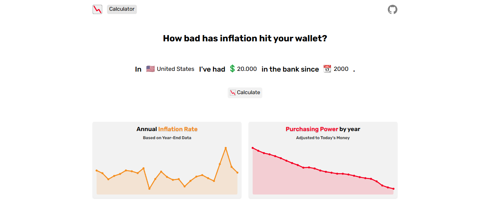

# Inflatio



[Inflatio](https://wdeloo.github.io/Inflatio/) is a web application that helps you calculate how inflation has affected your purchasing power.

## Self Hosting

1. Clone the repository:

```
git clone https://github.com/wdeloo/Inflatio.git
cd Inflatio
```

2. Install dependencies and build the project:

```
npm install
npm run build
```

3. Start the server:

```
npm run start
```
